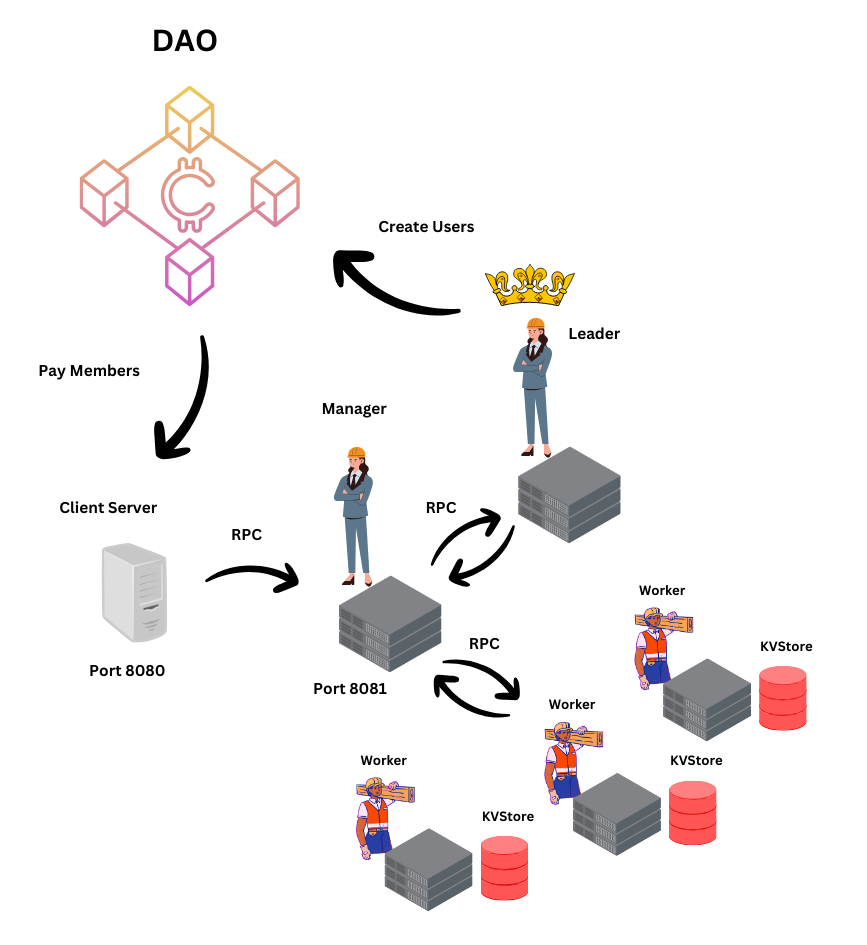

# MusallDAO

The DAO where music is shared between fans and creators. Lowering the barrier to entry for music investors. Royalties are shared. We all earn together.

## Key features

- Censorship resistant
- Completely on-chain, back and front-end
- Recursive incentives
- Community Managed
- Immediate payment of royalties

## Goals

- Create Rust DAO with public methods - done
- Create heartbeat and set timing to minimize cycles - done
- Create Calls to the Cluster
- Expose calls to the Masters nodes of the Cluster
- Determine assets and payment criteria to members
- Create front end in Svelte or React for user login and DAO registration
- Blackhole the DAO 

## Architecture

The DAO communicates with the hosted cluster via the Client RPC server, but is sent messages from the Leader of the Cluster.

 <h3 align="center" > </h3
